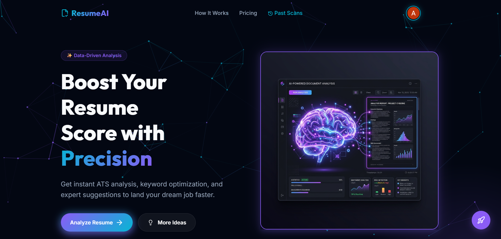
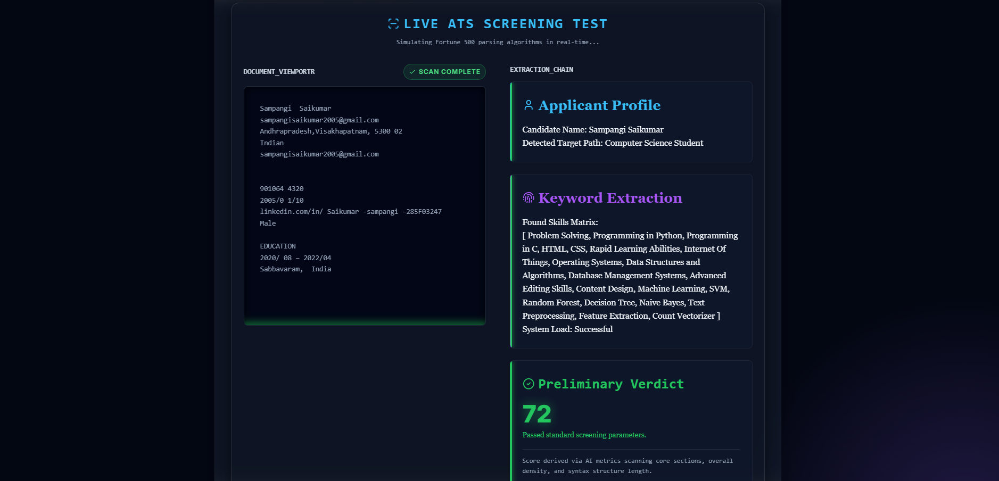
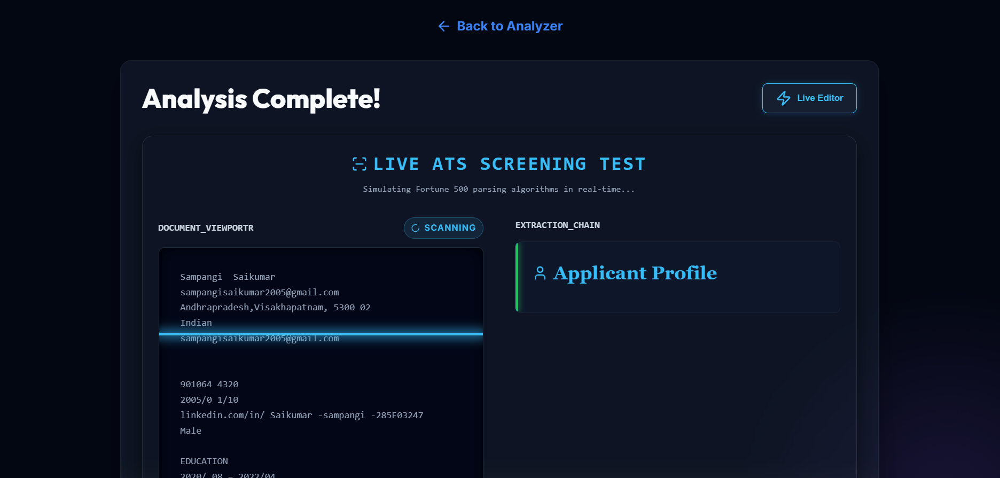
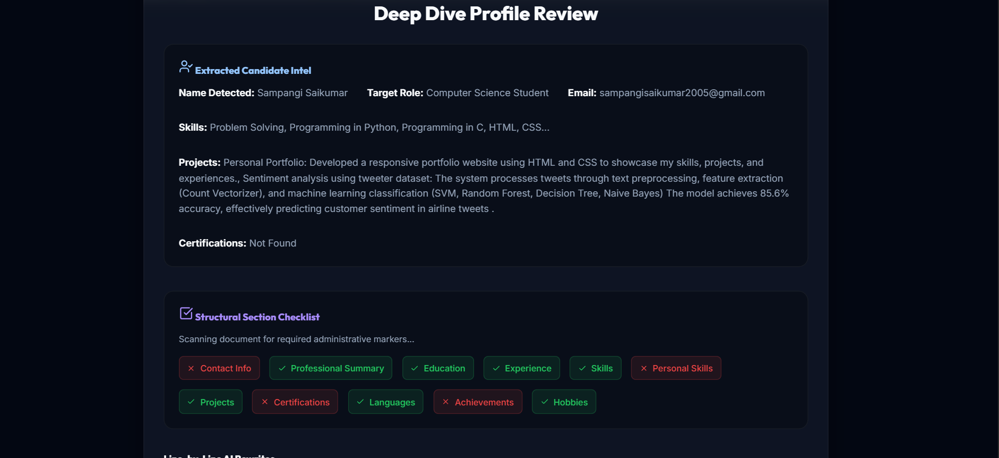
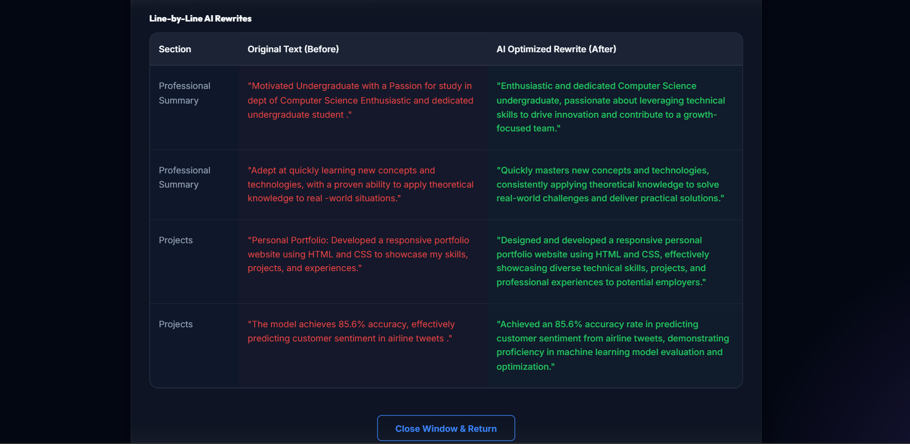

# 🚀 AI Resume Analyzer

An intelligent web application that analyzes resumes and provides ATS (Applicant Tracking System) scores along with actionable insights to improve your chances of getting hired.

---

## 🔥 Features

✔ Upload Resume (PDF/DOCX support)  
✔ ATS Score Evaluation  
✔ Keyword Optimization Suggestions  
✔ Resume Quality Analysis  
✔ Resume Rewrite Suggestions  
✔ Skill Gap Identification  

---

## 🧠 Tech Stack

- Python (Flask)
- HTML, CSS
- JavaScript
- Machine Learning (for analysis)

---

## 📸 Screenshots

### 🏠 Home Page

### 📊 Resume Score Result

### 🔍 Resume Scan

### 🧩 Skills Analysis

### ✍️ Resume Rewrite Suggestions

---

## 🌐 Live Demo

👉 https://smartresume.pythonanywhere.com/

---

## 🎯 Purpose

This project helps job seekers improve their resumes by analyzing content and providing intelligent suggestions based on ATS systems used by recruiters.

---

## 💡 Future Improvements

- AI-based resume rewriting
- More accurate scoring model
- Job-specific suggestions
- Dashboard for tracking improvements

---

## 👤 Author

**Neelapu Mokshanya**

- GitHub: https://github.com/Mokshanya
- LinkedIn: (add your link here)

---

⭐ If you like this project, give it a star!
---

## 📂 Project Structure
